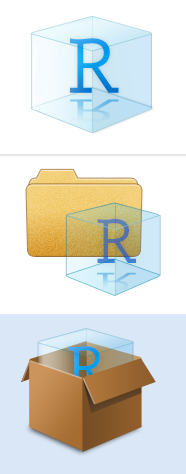

```{r setup, include=FALSE}
library(knitr)
opts_chunk$set(echo = FALSE)
```
<style>
div.footnotes {
  bottom: .01;
  width: 80%;
  font-size: 0.55em;
}
</style>

<script src="https://ajax.googleapis.com/ajax/libs/jquery/3.1.1/jquery.min.js"></script><script>
$(document).ready(function() {
  $('slide:not(.backdrop):not(.title-slide)').append('<div class=\"footnotes\">');
  $('footnote').each(function(index) {
    var text  = $(this).html();
    var fnNum = (index+1).toString();
    $(this).html(fnNum.sup());
    var footnote   = fnNum + '. ' + text + '<br/>';
    var oldContent = $(this).parents('slide').children('div.footnotes').html();
    var newContent = oldContent + footnote;
    $(this).parents('slide').children('div.footnotes').html(newContent);
  });});
</script>

```{css styling}
/* Make the HU logo bigger */
slides > slide:not(.nobackground):before {
  width: 100px;
  height: 100px;
  background-size: 100px 100px;
}

/* Make the background plain white */
slides > slide {
  background: linear-gradient(white, white);
}
```

## Schedule

<<<<<<< HEAD
1. Working in different contexts: RStudio Projects
2. Dynamic document generation: RMarkdown
3. Version control: Git + GitHub
4. Environment management: renv
5. Docker
6. Start collaborating
=======
1. RStudio Projects
2. RMarkdown
3. Git + GitHub
4. **Environment management**: renv
5. **Containerization**: Docker
6. **Start collaborating**
>>>>>>> 9ca8df730dc22aef346b9b4b6549f14cef5e23a7

## 0. Kudos

- Peikert, A., & Brandmaier, A. M. (2020). A Reproducible Data Analysis Workflow with R Markdown, Git, Make, and Docker. https://doi.org/10.31234/osf.io/8xzqy

```{r out.width='75%', fig.align='center'}
include_graphics("figures/peikert_preprint.png")
```

<<<<<<< HEAD
## 1. RStudio Projects - What & Why?
```{r out.extra='style="float:right; padding:10px"', out.width = '10%'}

```
=======
## 1. RStudio Projects – What & Why?
>>>>>>> 9ca8df730dc22aef346b9b4b6549f14cef5e23a7

- **What it does**:
  + allows to work in multiple different contexts (projects), e.g. one for each experiment
  + each project is own working directory, workspace, history, and source documents
  + each project is associated with a folder on your computer (= working directory)
- **Why it helps**:
  + have a separate, shareable working environment for each experiment
  + keep all the files associated with a project together — data, scripts, results, figures
  + work on multiple projects at once, each associated with its packages (and package versions), loaded data, etc. 
  + use only relative paths
  + necessary to apply version control

## 1. RStudio Projects – How?

- In RStudio: File > New Project > ...
- (Example using the sleepstudy data set from lme4)

## 1. RStudio Projects – Troubleshooting

- If necessary

<<<<<<< HEAD
## 2. Dynamic document generation: RMarkdown - What & Why?
```{r out.extra='style="float:right; padding:10px"', out.width = '10%'}
include_graphics("figures/rmarkdown.png")
```

- **What it does:**
  + Creates dynamic documents with embedded chunks of code (R, python, Julia, stan, ...), computed results , written text etc. (= LaTex) 
  + Markdown-files can be exported to documents (docx, rtf), presentations, pdfs, or websites (html) <footnote content="packages"> e.g using the `knitr` (Xie, 2015, 2020) and `tinytex` (Xie, 2015, 2020; for pdfs)</footnote>
  + R code is dynamically rendered, and can be given in separate chunks ('''{r}   ''') or inline (' r  … ')
- **Why it helps:**
  + Simple language ($\neq$ LaTex)
  + Integrates directly with statistical software (R Studio)
  + Saves code and output in one file
  + Reduces copy&paste errors: reported results consistent with actual results
=======
## 2. RMarkdown – What & Why?
>>>>>>> 9ca8df730dc22aef346b9b4b6549f14cef5e23a7


<<<<<<< HEAD
## 2. Dynamic document generation: RMarkdown - How?

- ...

## 2. Dynamic document generation: RMarkdown - Troubleshooting
=======
## 2. RMarkdown – How?

- ...

## 2. RMarkdown – Troubleshooting

- If necessary
>>>>>>> 9ca8df730dc22aef346b9b4b6549f14cef5e23a7

## 3. Version control: Git + GitHub

```{r, fig.align='right'}
include_graphics("figures/jesus.jpg")
```

<<<<<<< HEAD
## 3. Version control: Git + GitHub - What & Why?
=======
## 3. Git + GitHub – What & Why?
>>>>>>> 9ca8df730dc22aef346b9b4b6549f14cef5e23a7

- What it does:
  + ...
  + ...
- Why it helps:
  + ...
  + ...

<<<<<<< HEAD
## 3. Version control: Git + GitHub - How?
=======
## 3. Git + GitHub – How?
>>>>>>> 9ca8df730dc22aef346b9b4b6549f14cef5e23a7

- ...

## 3. Git + GitHub - Troubleshooting

- If necessary

## 4. Environment management: renv

```{r out.width='70%', fig.align='right'}
# # This was used to create the plot. To run this code, please install pkggraph and ggplot2.
# library(pkggraph)
# library(dplyr)
# library(ggplot2)
# get_all_dependencies("lmerTest", level = 10, relation = c("Depends", "Imports"), strict = TRUE) %>%
#   make_neighborhood_graph() %>%
#   plot(background = "white") +
#   theme(panel.border = element_rect(color = "white")) +
#   ggsave("figures/lmerTest_depends.png", width = 20, height = 14, units = "cm", dpi = 600)
include_graphics("figures/lmerTest_depends.png")
```

## 4. renv – What & Why?

- What it does:
  + Creates a project-specific library of packages in the project folder
  + Overwrites `install.packages()` to install packages there
  + Keeps track of package versions in the `renv.lock` file
- Why it helps:
  + Keeps package versions untouched by other projects
  + Allows you to revert to the previous state when an update has broken your analysis
  + Makes it easier to share package versions with your collaborators (e.g., via GitHub)

```{r fig.align='right'}
include_graphics("figures/renv.png")
```

## 4. renv – How?

1. Install the renv package: `install.packages(renv)`
2. Initialize your project library: `renv::init()`
3. Install and update your packages as usual: `install.packages("pkgname")`
3. Save the current state of the project library: `renv::snapshot()`
4. Revert to a previous state if an update caused problems: `renv::restore()`

You can skip step #2 if you select "Use renv with this project" during project creation.

```{r fig.align='right'}
include_graphics("figures/renv.png")
```

## 4. renv – Troubleshooting

- If necessary

## 5. Containerization: Docker

```{r fig.align='right'}
include_graphics("figures/containers.jpg")
```

## 5. Docker – What & Why?

- What it does:
  + ...
  + ...
- Why it helps:
  + ...
  + ...

## 5. Docker – How?

- ...

## 5. Docker – Troubleshooting

- If necessary

## 6. Start colaborating

- ...

