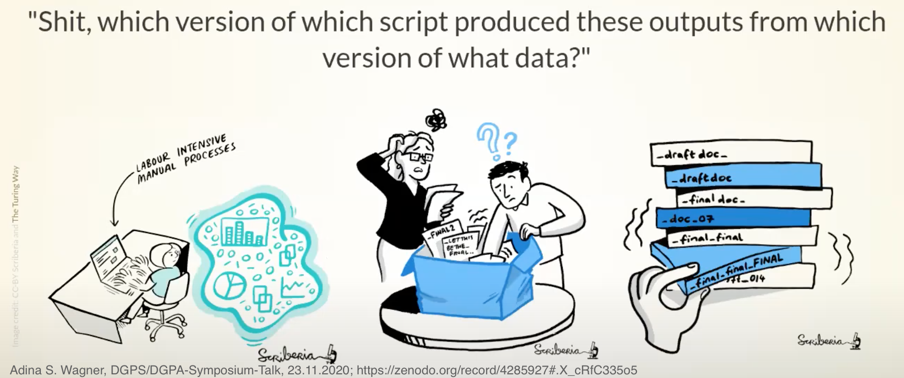
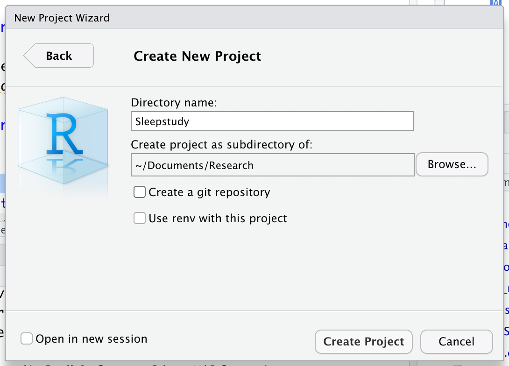
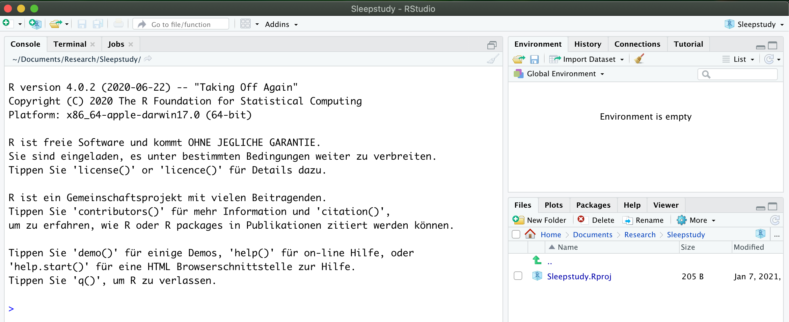
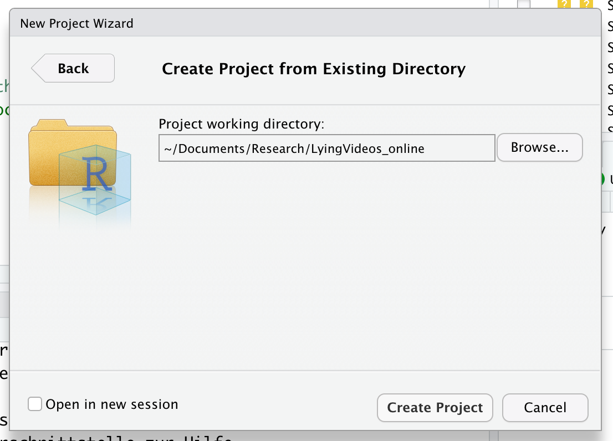
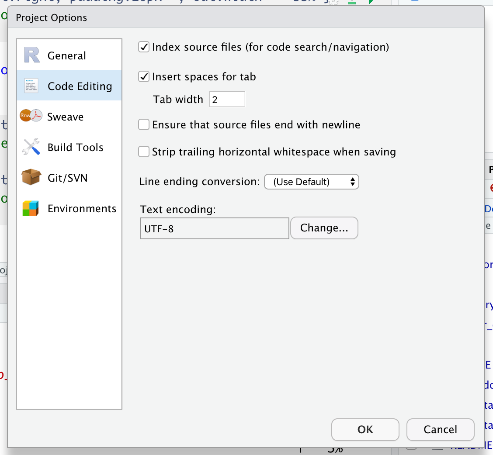
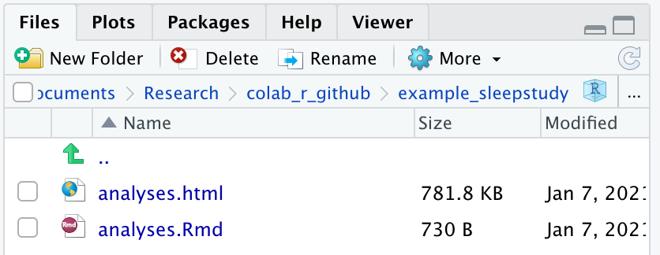

```{r setup, include=FALSE}
library(knitr)
opts_chunk$set(echo = FALSE)
```

<script src="https://ajax.googleapis.com/ajax/libs/jquery/3.1.1/jquery.min.js"></script>
<script>
$(document).ready(function() {
  $('slide:not(.backdrop):not(.title-slide)').append('<div class=\"footnotes\">');
  $('footnote').each(function(index) {
    var text  = $(this).html();
    var fnNum = (index+1).toString();
    $(this).html(fnNum.sup());
    var footnote   = fnNum + '. ' + text + '<br/>';
    var oldContent = $(this).parents('slide').children('div.footnotes').html();
    var newContent = oldContent + footnote;
    $(this).parents('slide').children('div.footnotes').html(newContent);
  });});
</script>

```{css styling}
/* Make the HU logo bigger */
slides > slide:not(.nobackground):before {
  width: 100px;
  height: 100px;
  background-size: 100px 100px;
}

/* Make the background plain white on normal slides*/
slides > slide {
  background: white;
}

/* Make the background HU blue on title slides */
slides > slide.dark {
  background: #072859 !important;
}

/* Make the font white on title slides */
.auto-fadein h2{
  color: white;
  position: relative;
  top: 100px;
}

/* Enable footnotes */
div.footnotes {
  bottom: .01;
  width: 80%;
  font-size: 0.55em;
  margin-left: 120px;
}
```

## Collaborating on Reproducible Code... !?

<div class="columns-2">

<br>

### Collaborating:

You and your collaborators (including your<br>future self) can access the code *and its history*

### Reproducible:

Your code runs and reproduces identical results<br>*at different time points* and *on different systems*

</div>

```{r fig.align='center', out.width='70%'}
include_graphics("figures/turing.jpg")
```

## Schedule

```{r out.extra='style="float:right; padding:10px"', out.width='30%'}
include_graphics("figures/schedule_icons.png")
```

1. **Working in different contexts:** RStudio Projects
2. **Dynamic document generation:** RMarkdown
3. **Version control:** Git + GitHub
4. **Package management**: renv
5. **Containerization**: Docker
6. **Where should I start?**

## 0. Kudos

- Peikert, A., & Brandmaier, A. M. (2020). **A Reproducible Data Analysis Workflow with R Markdown, Git, Make, and Docker.** https://doi.org/10.31234/osf.io/8xzqy

```{r out.width='100%', fig.align='center'}
include_graphics("figures/peikert_preprint.png")
```

## 0. Kudos

- Andreas A. Brandmaier: **"A Reproducible Data Analysis Workflow with R Markdown, Git, Make, and Docker"**, talk at the Online Symposium on Reproducing Analyses in Biological Psychology, November 2020 (https://www.youtube.com/watch?v=nTVcMDVlyOI)
- Richard McElreath: **"Science as Amateur Software Development"**, talk at the Max Planck IT Community, August 2020 (https://www.youtube.com/watch?v=zwRdO9_GGhY)
- Russ Poldrack: **"Toward a Culture of Computational Reproducibility"**, talk at the Foundations of Biomedical Data Science, December 2020 (https://www.youtube.com/watch?v=XjW3t-qXAiE)

<br>

```{r out.width='100%', fig.align='center'}
include_graphics("figures/kudos_talks.png")
```

## 0. Collaborating with yourself and others
```{r, fig.align='center', out.width='90%'}

```

## 1. Working in different contexts: RStudio Projects - What & Why?
```{r out.extra='style="float:right; padding:10px"', out.width = '10%'}
include_graphics("figures/RStudioProject.png")
```

- **What it does**:
  + Allows to work in multiple different contexts (projects), e.g. one for each experiment
  + Each project is own working directory, workspace, history, and source documents
  + Each project is associated with a folder on your computer (= working directory)
- **Why it helps**:
  + Have a separate, shareable working environment for each experiment
  + Keep all the files associated with a project together — data, scripts, results, figures
  + Work on multiple projects at once, each associated with its packages (and package versions), loaded data, etc. 
  + Use only relative paths
  + Necessary basis for version control

## 1. Working in different contexts: RStudio Projects – How?

- In RStudio: File > New Project > ...

```{r out.extra='style="float:left; padding:10px"', out.width = '40%'}
include_graphics("figures/NewProject.png")
```
```{r out.extra='style="float:right; padding:10px"', out.width = '50%'}
include_graphics("figures/CreateProject.png")
```

## 1. Working in different contexts: RStudio Projects – Version 1: Create new project

```{r out.extra='style="float:left; padding:10px"', out.width = '35%'}
include_graphics("figures/CreateProject.png")
```
```{r out.extra='style="float:right; padding:10px"', out.width = '55%'}

```

## 1. Working in different contexts: RStudio Projects – Version 1: Create new project

```{r out.extra='style="float:left; padding:10px"', out.width = '35%'}

```
```{r out.extra='style="float:right; padding:10px"', out.width = '55%'}
include_graphics("figures/CreateNewProjectType.png")
```

## 1. Working in different contexts: RStudio Projects – Version 1: Create new project

```{r out.extra='style="float:left"', out.width = '100%'}

```

## 1. Working in different contexts: RStudio Projects – Version 2: Create from existing directory

```{r out.extra='style="float:left; padding:10px"', out.width = '35%'}
include_graphics("figures/CreateProject.png")
```
```{r out.extra='style="float:right; padding:10px"', out.width = '55%'}

```

## 1. Working in different contexts: RStudio Projects – Version 3: Create from version control (Git)

```{r out.extra='style="float:left; padding:10px"', out.width = '35%'}
include_graphics("figures/CreateProject.png")
```
```{r out.extra='style="float:right; padding:10px"', out.width = '55%'}
include_graphics("figures/CreateProjectFromVersionControl.png")
```

## 1. Working in different contexts: RStudio Projects – Version 3: Create from version control (Git)

```{r out.extra='style="float:left; padding:10px"', out.width = '35%'}
include_graphics("figures/CreateProjectFromVersionControl.png")
```
```{r out.extra='style="float:right; padding:10px"', out.width = '55%'}
include_graphics("figures/CloneGitRepository.png")
```

## 1. Working in different contexts: RStudio Projects – Open and manage projects

```{r out.extra='style="float:left; padding:10px"', out.width = '25%'}
include_graphics("figures/OpenProject.png")
```
```{r out.extra='style="float:left; padding:10px"', out.width = '70%'}
include_graphics("figures/ChooseProject.png")
```

## 1. Working in different contexts: RStudio Projects – Open and manage projects
```{r, fig.align='center'}

```


## 1. Working in different contexts: RStudio Projects – Tricks and troubleshooting

- **Relative paths:** path separator characters vary across systems & anchor points differ depending on contexts
  + **Use the `here`-package (Müller, 2020) to define relative paths within the project: `read.csv(here::here("data", "file_I_want.csv"))`**

## 2. Dynamic document generation: RMarkdown - What & Why?
```{r out.extra='style="float:right; padding:10px"', out.width = '10%'}
include_graphics("figures/rmarkdown.png")
```

- **What it does:**
  + Creates dynamic documents with embedded chunks of code (R, python, Julia, stan, ...), computed results , written text etc. (= LaTeX) 
  + Markdown-files can be exported to documents (docx, rtf), presentations, pdfs, websites (html), ... <footnote content="packages"> e.g using the `knitr` (Xie, 2015, 2020) and `tinytex` (Xie, 2015, 2020; for pdfs)</footnote>
  + R code is dynamically rendered, and can be given in separate chunks ('''{r}   ''') or inline (' r  … ')
- **Why it helps:**
  + Simple language ($\neq$ LaTeX)
  + Integrates directly with statistical software (R Studio)
  + Saves code and output in one file
  + Reduces copy&paste errors: reported results consistent with actual results

## 2. Dynamic document generation: RMarkdown - How?

- Installation: `install.packages("rmarkdown")`

## 2. Dynamic document generation: RMarkdown - How?

- Installation: `install.packages("rmarkdown")`
- Open a markdown file: File > New File > R Markdown


```{r out.extra='style="float:left"', out.width = '35%'}
include_graphics("figures/RMarkdown_newfile.png")
```


## 2. Dynamic document generation: RMarkdown - How?

- Installation: `install.packages("rmarkdown")`
- Open a markdown file: File > New File > R Markdown

```{r out.extra='style="float:left; padding:10px"', out.width = '35%'}
include_graphics("figures/RMarkdown_newfile.png")
```
```{r out.extra='style="float:right; padding:10px"', out.width = '55%'}
include_graphics("figures/RMarkdown_fileformat.png")
```

## {data-background="figures/RMarkdown_file_plain.png"}
## {data-background="figures/RMarkdown_file_header.png"}
## {data-background="figures/RMarkdown_file_text.png"}
## {data-background="figures/RMarkdown_file_Rcode.png"}
## {data-background="figures/RMarkdown_file_knit.png"}
## {data-background="figures/RMarkdownFile.png"}
## {data-background="figures/RMarkdown_output.png"}
## {data-background="figures/RMarkdown_output.png"}
```{r fig.align = "right", out.width = '35%'}

```


## 2. Dynamic document generation: RMarkdown - Tricks & troubleshooting

- You don't have RStudio installed: **install Pandoc (http://pandoc.org)** before installing *markdown* ()
- Lengthy R code chunks: **Install `knitr`-package (Xie, 2014, 2015, 2020) to customize chunks and knitting process** 
  + `{r cache=TRUE,message=FALSE,warning=FALSE,results="hide", error = TRUE}`
  + or use `opts_chunk$set()`-function
- Knit to pdf: You need a **LaTeX-installation**
  + **`TinyTeX`** (Xie, 2010) is a light-weight, cross-platform distribution (`install.packages("tinytex"); tinytex::install_tinytex())`)
  - Separate code chunks by a blank line


## 3. Version control: Git + GitHub - What & Why?

```{r, fig.align='center', out.width = '65%'}
include_graphics("figures/jesus.jpg")
```

## 3. Version control: Git + GitHub - What & Why?

- What it does:
  + Tracks changes to files (data and code) over time: Sequence of "snapshots" (**commits**) wit unique identifiers (hash code) and describition (commit message)
  + Allows to "go back in time": Recall older versions or to revert the entire project
  + Changes between commits can be compared
  + Organized in **repositories**: Collection of all snapshots
  + **GitHub**: Popular server for sharing materials (*privately or publicly*) and collaborating via git (also: GitLab and others)
  
## 3. Version control: Git + GitHub - What & Why?

```{r out.extra='style="float:right; padding:10px"', out.width = '35%'}
include_graphics("figures/VersionControl.png")
```

- Why it helps:
  + Keep things organized and track changes
  + Clean up code
  + Language agnostic
  + (Remote) backup
  + Work together (even simultaneously and parallely: branches, merges, pull requests)
  + Web interface to track issues
  + Easily connected e.g. to osf.io

## 3. Version control: Git + GitHub – How?

- ...

## 3. Version control: Git + GitHub - Troubleshooting

- **Github:** No long-term guarantee for availability of service (is commercial) 
  - **Mirror snapshots on hu servers/osf/zenodo/FigShare/...**

# 4. Package management: renv

```{r out.width='55%', fig.align='right'}
# # This was used to create the plot. To run this code, please install pkggraph and ggplot2.
# library(dplyr)
# library(ggplot2)
# pkggraph::init(local = TRUE)
# pkggraph::get_all_dependencies("lmerTest", level = 10, relation = c("Depends", "Imports"), strict = TRUE) %>%
#   pkggraph::make_neighborhood_graph() %>%
#   plot() +
#   theme(panel.border = element_rect()) +
#   ggsave("figures/lmerTest_depends.png", width = 20, height = 14, units = "cm", dpi = 600)
include_graphics("figures/lmerTest_depends.png")
```

## 4. renv – What & Why?

```{r out.extra='style="float:right; padding:10px"', out.width = '10%'}
include_graphics("figures/renv.png")
```

- What it does:
  + Creates a project-specific library of packages in the project folder
  + Overwrites `install.packages()` to install packages in this local library
  + Keeps track of package versions in the `renv.lock` file

<br>

- Why it helps:
  + Keeps package versions untouched by other projects
  + Allows you to revert to the previous state when an update has broken your analysis
  + Makes it easier to share package versions with your collaborators (e.g., via GitHub)

## 4. renv – How?

```{r out.extra='style="float:right; padding:10px"', out.width = '10%'}
include_graphics("figures/renv.png")
```

1. Install renv just like any other R package via `install.packages(renv)`
2. Initialize your project library via `renv::init()`<br>(Instead, you can also select "Use renv with this project" during project creation)
3. After successfully installing or updating packages, use `renv::snapshot()`
4. If you want to revert to previous state (e.g., if an update caused problems), use `renv::restore()`

## 4. renv – How?

```{r fig.align='right', out.width='90%'}
include_graphics("figures/renv_init.png")
```

## 4. renv – Code along

- Initialize renv for your sleepstudy project using `renv::init()`
- From the Files pane in RStudio, take a look at the `renv.lock` file
- Install a new package:

```{r, echo=TRUE, eval=FALSE}
install.packages("cowsay")
```

- Acutally use the package in one of your scripts (or `.Rmd` files):

```{r, echo=TRUE, results='hide'}
cowsay::say("Hello world", "cow")
```

- Write this change to the lockfile using `renv::snapshot()`
- Commit and push your changes to GitHub

## 4. renv – How?

```{r out.extra='style="float:right; padding:10px"', out.width = '10%'}
include_graphics("figures/renv.png")
```

Restoring someone else's package versions:

1. Clone or pull the repository from GitHub
2. Open the the RStudio project (e.g. via the `projectname.Rproj` file)
3. Use `renv::restore()` to install the package versions from the `renv.lock` file

## 4. renv – Troubleshooting

- There may be some (inconsequential) warnings when switching between Mac and Windows
- At least on Windows, you need to have Rtools installed when installing packages that are not on CRAN (https://cran.r-project.org/bin/windows/Rtools/)
- Installing and loading packages may take a while, especially if your project lives on a network drive<br>(such as `N:/`)

# 5. Containerization: Docker

```{r fig.align='right', out.width='55%'}
include_graphics("figures/containers.jpg")
```

## 5. Docker – What & Why?

- What it does:
  + Creates a small, linux-based virtual machine on your computer
  + Makes it possible to run your scripts (or render your `.Rmd` files) on this virtual system
  + The recipe to build this system is stored in a `Dockerfile` that can be shared via GitHub

<br>

- Why it helps:
  + Prevents differences between operating systems, R versions, region and language settings etc.
  + Ensures long-term reproducibility
  + Provides a starting point for cloud-based and high perfomance computing (HPC)
  + Pre-packaged Docker images are available for lots of different languages (R, Python, MATLAB, LaTeX etc.)

```{r out.extra='style="float:right; padding:10px"', out.width = '10%'}
include_graphics("figures/docker.png")
```

## 5. Docker – How?

- Install Docker from https://docs.docker.com/installation/
- From the terminal, start a R/RStudio container and mount your local project folder:

```{bash, echo=TRUE, eval=FALSE}
docker run -d  -e PASSWORD=1234 -p 8787:8787 -v /path/to/your/project:/home/rstudio/ rocker/rstudio
```

- You can then access RStudio (running in the container) by opening http://localhost:8787 in your web browser (username: rstudio, password: 1234)
- You can also build your own container by:
  + Choosing a base image from https://hub.docker.com/u/rocker (including the tidyverse, LaTeX etc.)
  + Creating a `Dockerfile` in your project directy, specyfing additional steps to execute when building the container, e.g., `install.packages("renv"); renv::restore()`
  
```{r out.extra='style="float:right; padding:10px"', out.width = '10%'}
include_graphics("figures/docker.png")
```

- For detailled instructions, see [Boettiger & Eddeulbuettel (2017)](https://journal.r-project.org/archive/2017/RJ-2017-065/index.html) and<br>[Peikert & Brandmaier (2020)](https://psyarxiv.com/8xzqy/)

## 5. Docker – How?

- Example for a Dockerfile:

```{bash, echo=TRUE, eval=FALSE}
# This as a text file stored with the name "Dockerfile" in your project directory.

# Base image from Docker Hub, including R, RStudio, the tidyverse, and LaTeX
FROM rocker/verse:4.0.2

# Set working directory within the container
WORDIR /home/rstudio

# Install renv
RUN R -e "remotes::install_version('renv', version = '0.12.0', repos = 'http://cran.us.r-project.org')"

# Copy the lock file
COPY renv.lock renv.lock

# Install package versions stored in the lockfile
RUN R -e "renv::consent(provided = TRUE)"
RUN R -e "renv::restore(prompt = FALSE)"
```

## 5. Docker – Beyond Docker

- Some additional tools based on Docker:
  + With **binder** (https://mybinder.org) and **Code Ocean** (https://codeocean.com), you can run your analysis in the cloud; they will even create the `Dockerfile` for you if you don't have your own one
  + **Singularity** (https://sylabs.io) is a fully compatible, open source clone of Docker which you can use on systems where you don't have root access (e.g., on high performance clusters)

<br>

```{r, fig.align='center', out.width='80%'}
include_graphics("figures/binder_co_sing.png")
```

# 6. Where should I start?

```{r fig.align='right', out.width='60%'}
include_graphics("figures/where2start.jpeg")
```

## 6. Where should I start?

- Suggested order of steps, minimal and maximal version

# Thank you.

```{r fig.align='right', out.width='80%'}
include_graphics("figures/castle.png")
```

