```{r setup, include=FALSE}
library(knitr)
opts_chunk$set(echo = FALSE)
```

<script src="https://ajax.googleapis.com/ajax/libs/jquery/3.1.1/jquery.min.js"></script>
<script>
$(document).ready(function() {
  $('slide:not(.backdrop):not(.title-slide)').append('<div class=\"footnotes\">');
  $('footnote').each(function(index) {
    var text  = $(this).html();
    var fnNum = (index+1).toString();
    $(this).html(fnNum.sup());
    var footnote   = fnNum + '. ' + text + '<br/>';
    var oldContent = $(this).parents('slide').children('div.footnotes').html();
    var newContent = oldContent + footnote;
    $(this).parents('slide').children('div.footnotes').html(newContent);
  });});
</script>

```{css styling}
/* Make the HU logo bigger */
slides > slide:not(.nobackground):before {
  width: 100px;
  height: 100px;
  background-size: 100px 100px;
}

/* Make the background plain white on normal slides*/
slides > slide {
  background: white;
}

/* Make the background HU blue on title slides */
slides > slide.dark {
  background: #072859 !important;
}

/* Make the font white on title slides */
.auto-fadein h2{
  color: white;
  position: relative;
  top: 100px;
}

/* Enable footnotes */
div.footnotes {
  bottom: .01;
  width: 80%;
  font-size: 0.55em;
  margin-left: 120px;
}
```

## Collaborating on Reproducible Code... !?

<div class="columns-2">

<br>

### Collaborating:

You and your collaborators (including your<br>future self) can access *the code and its history*

### Reproducible:

Your code runs and produces identical results<br>*at different time points* and *on different systems*

</div>

```{r fig.align='center', out.width='70%'}
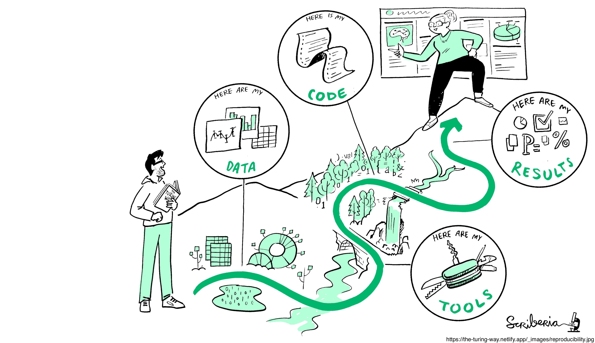
```

## For example...

- Go to https://github.com/KirstenStark/colab_r_github (find this link in the Zoom chat)
  + Select Code > Download Zip
- You can also do this via git from the command line:
  + Note that this will download to your "home" directory (which you can find out typing `pwd`)

```{r eval=FALSE, echo=TRUE}
git clone https://github.com/KirstenStark/colab_r_github
```

```{r out.width='80%', fig.align='center'}
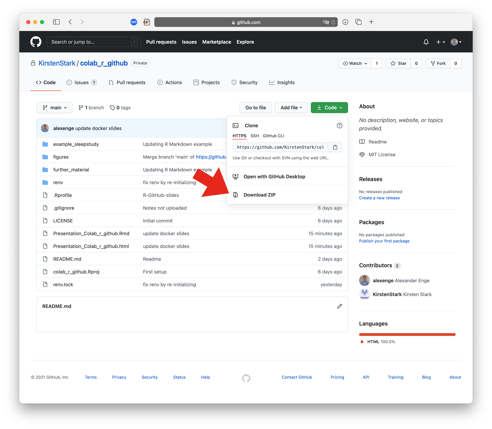
```

## Schedule

```{r out.extra='style="float:right; padding:10px"', out.width='30%'}
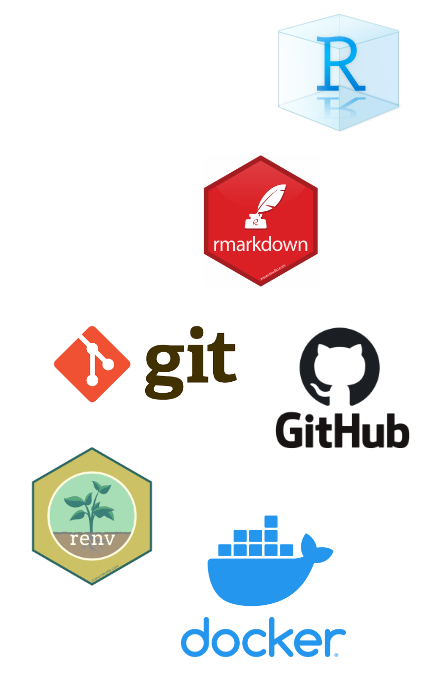
```

1. **Structuring working directories:** RStudio Projects
2. **Dynamic document generation:** RMarkdown
3. **Version control:** Git + GitHub
4. **Package management:** renv
5. **Containerization:** Docker
6. **Where to start?**

## 0. Kudos

- Peikert, A., & Brandmaier, A. M. (2020). **A Reproducible Data Analysis Workflow with R Markdown, Git, Make, and Docker.** *PsyArXiv Preprints.* https://doi.org/10.31234/osf.io/8xzqy

```{r out.width='100%', fig.align='center'}
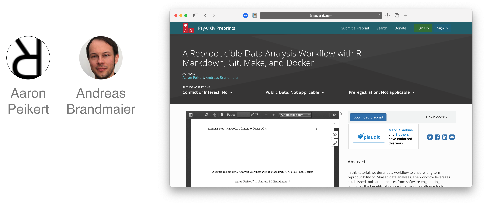
```

## 0. Kudos

- Andreas Brandmaier: **"A Reproducible Data Analysis Workflow with R Markdown, Git, Make, and Docker"**, talk at the Online Symposium on Reproducing Analyses in Biological Psychology, November 2020 (https://www.youtube.com/watch?v=nTVcMDVlyOI)
- Richard McElreath: **"Science as Amateur Software Development"**, talk at the Max Planck IT Community, August 2020 (https://www.youtube.com/watch?v=zwRdO9_GGhY)
- Russ Poldrack: **"Toward a Culture of Computational Reproducibility"**, talk at the Foundations of Biomedical Data Science, December 2020 (https://www.youtube.com/watch?v=XjW3t-qXAiE)

<br>

```{r out.width='100%', fig.align='center'}

```

# 1. Structuring working directories: RStudio Projects

```{r fig.align = "right", out.width = '60%'}

```


## 1. RStudio Projects - What & Why?

```{r out.extra='style="float:right; padding:10px"', out.width = '10%'}
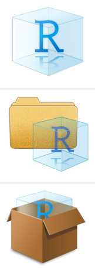
```

- **What it does**:
  + Allows working in multiple different contexts (projects), e.g. one for each experiment
  + Each project has its own working directory, workspace, history, and source documents
  + Each project is associated with a folder on your computer (= working directory)
  
## 1. RStudio Projects - What & Why?

```{r out.extra='style="float:right; padding:10px"', out.width = '10%'}

```

- **What it does**:
  + Allows working in multiple different contexts (projects), e.g. one for each experiment
  + Each project has its own working directory, workspace, history, and source documents
  + Each project is associated with a folder on your computer (= working directory)
    
<br>

- **Why it helps**:
  + Have a separate, shareable working environment for each experiment
  + Keep all the files associated with a project together — data, scripts, results, figures
  + Work on multiple projects at once, each associated with its packages (and package versions), loaded data, etc. 
  + Use only relative paths
  + Useful for version control

## 1. RStudio Projects – How?

- In RStudio: File > New Project > ...

```{r out.extra='style="float:left; padding:10px"', out.width = '40%'}
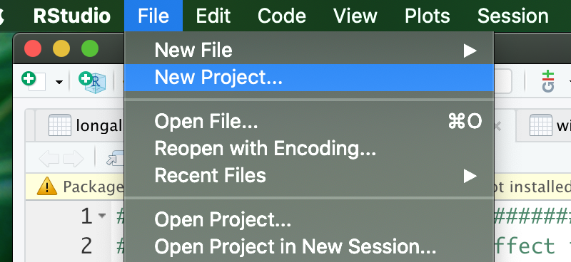
```

```{r out.extra='style="float:right; padding:10px"', out.width = '50%'}
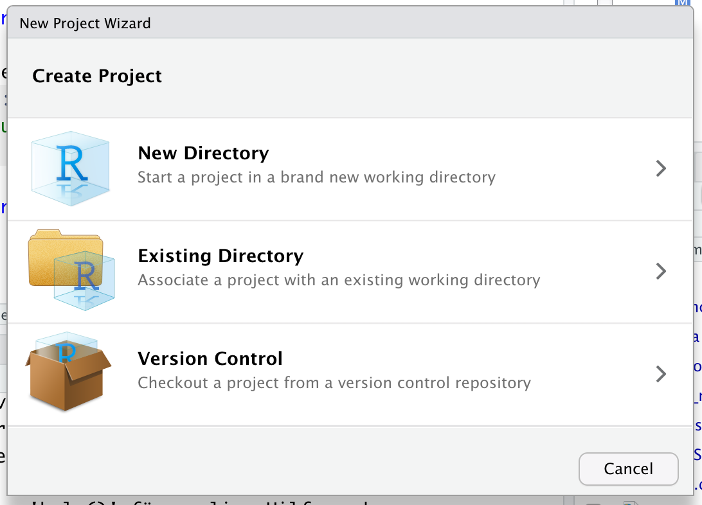
```

## 1. RStudio Projects – Version 1: Create new project

```{r out.extra='style="float:left; padding:10px"', out.width = '35%'}

```

```{r out.extra='style="float:right; padding:10px"', out.width = '55%'}
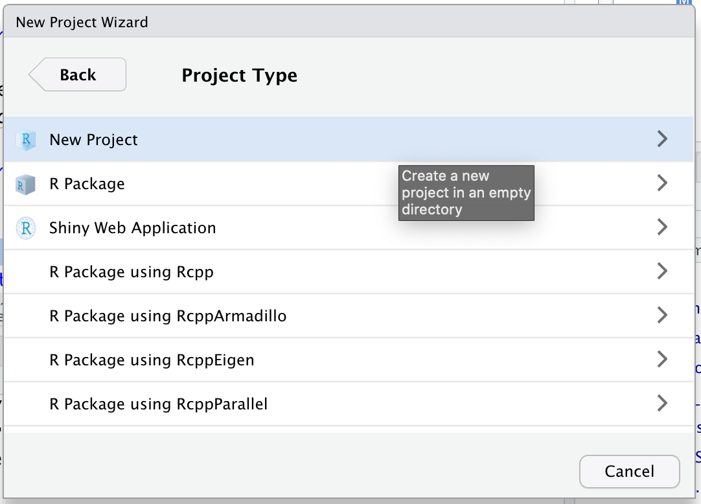
```

## 1. RStudio Projects – Version 1: Create new project

```{r out.extra='style="float:left; padding:10px"', out.width = '35%'}

```

```{r out.extra='style="float:right; padding:10px"', out.width = '55%'}
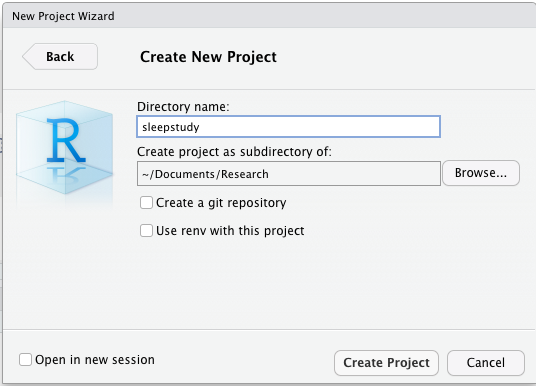
```

## 1. RStudio Projects – Version 1: Create new project

```{r out.extra='style="float:left"', out.width = '100%'}
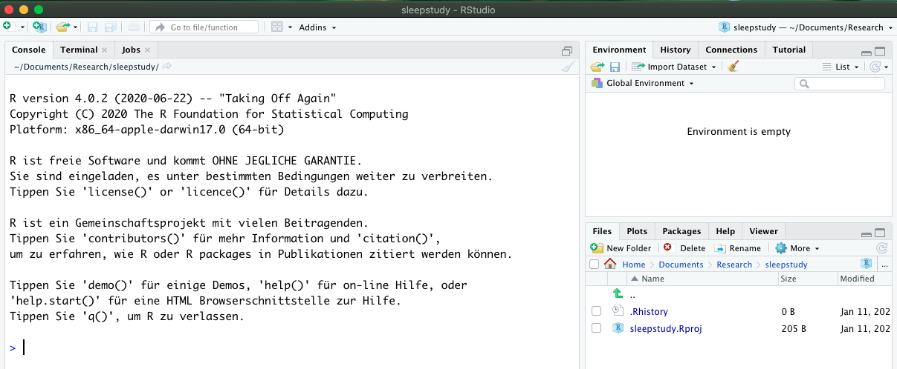
```

## 1. RStudio Projects – Version 2: Create from version control (Git)

```{r out.extra='style="float:left; padding:10px"', out.width = '35%'}

```

```{r out.extra='style="float:right; padding:10px"', out.width = '55%'}
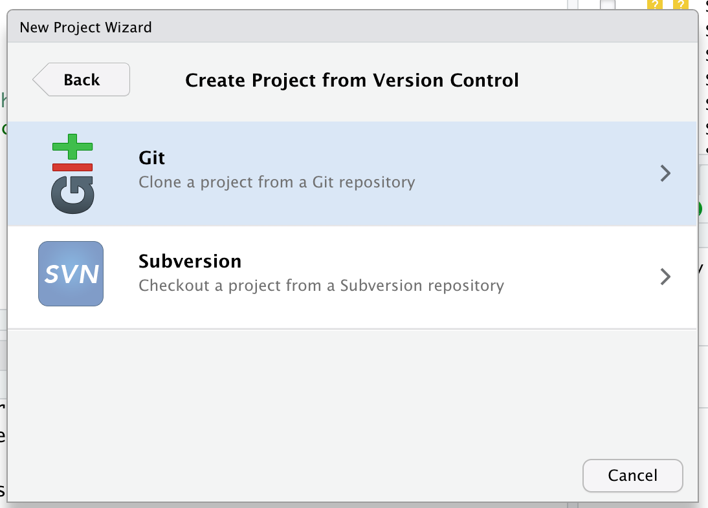
```

## 1. RStudio Projects – Version 2: Create from version control (Git)

```{r out.extra='style="float:left; padding:10px"', out.width = '35%'}

```

```{r out.extra='style="float:right; padding:10px"', out.width = '55%'}
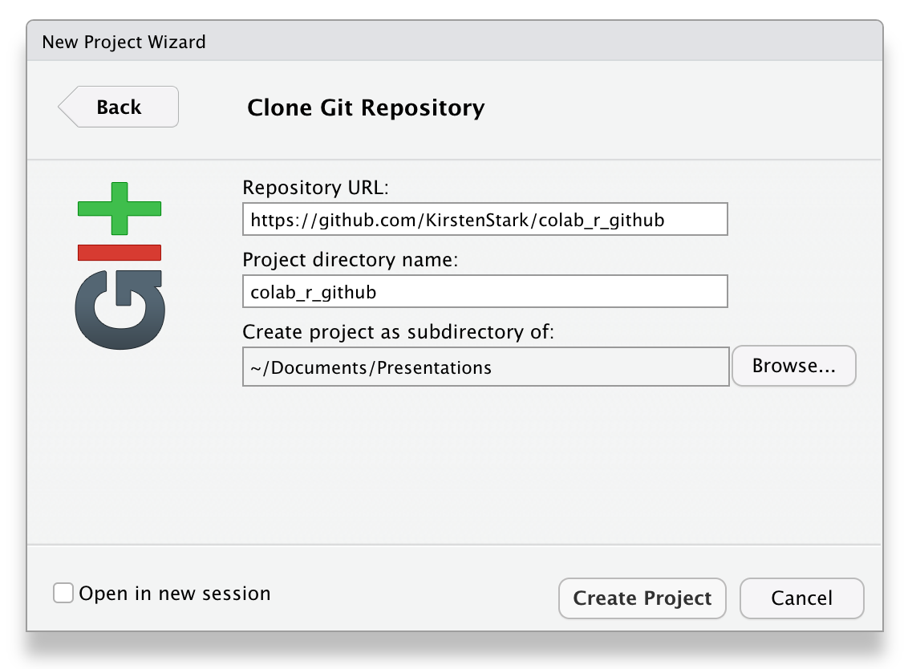
```

## 1. RStudio Projects – Open and manage projects

```{r out.extra='style="float:left; padding:10px"', out.width = '25%'}
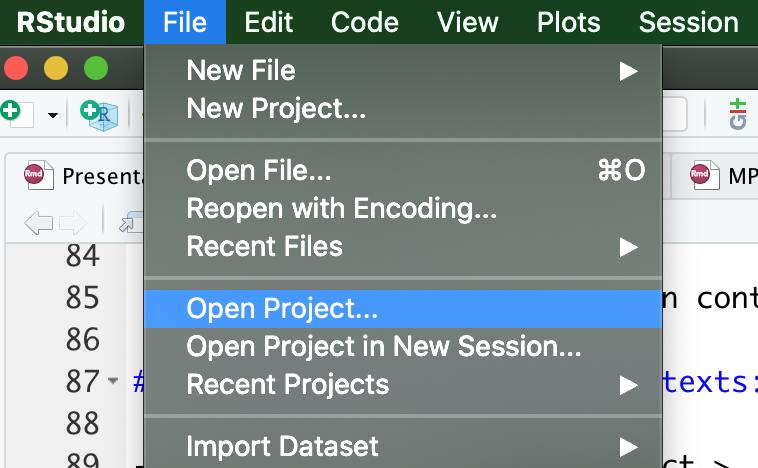
```

```{r out.extra='style="float:left; padding:10px"', out.width = '70%'}
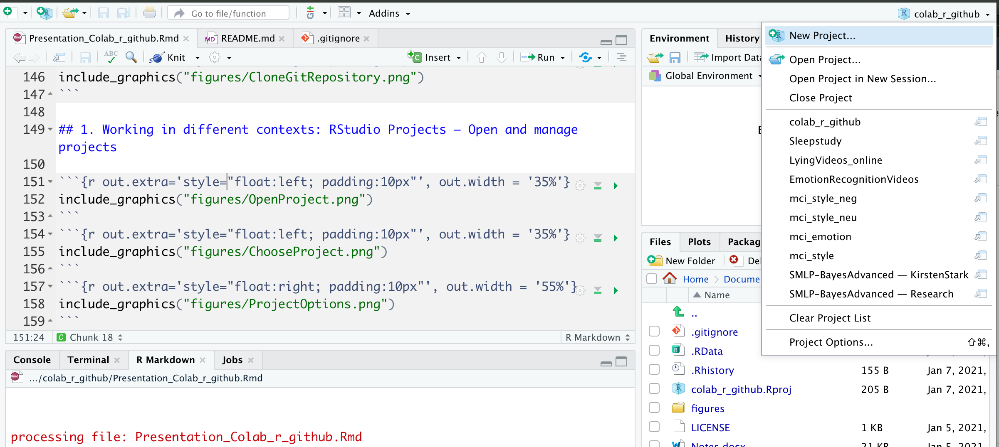
```

## 1. RStudio Projects – Tricks & troubleshooting

- **Relative paths:** path separator characters vary across systems, anchor points differ depending on contexts
  + **Use the `here`-package (Müller, 2020) to define relative paths within the project: `read.csv(here::here("data", "file_I_want.csv"))`**

# 2. Dynamic document generation: RMarkdown

```{r, fig.align='right', out.width = '55%'}
include_graphics("figures/rmarkdown_figure.png")
```

## 2. RMarkdown - What & Why?

```{r out.extra='style="float:right; padding:10px"', out.width = '10%'}

```

- **What it does:**
  + Creates dynamic documents with embedded chunks of code (R, Python, Julia, Stan, ...), computed results , written text, etc. (= LaTeX) 
  + Markdown-files can be exported to documents (docx, rtf), presentations, pdfs, websites (html), ... <footnote content="packages"> e.g using the `knitr` (Xie, 2015, 2020) and `tinytex` (Xie, 2015, 2020; for pdfs)</footnote>
  + R code is dynamically rendered, and can be given in separate chunks ('''{r}   ''') or inline (' r  … ')

## 2. RMarkdown - What & Why?

```{r out.extra='style="float:right; padding:10px"', out.width = '10%'}

```

- **What it does:**
  + Creates dynamic documents with embedded chunks of code (R, Python, Julia, Stan, ...), computed results , written text, etc. (= LaTeX) 
  + Markdown-files can be exported to documents (docx, rtf), presentations, pdfs, websites (html), ... <footnote content="packages"> e.g using the `knitr` (Xie, 2015, 2020) and `tinytex` (Xie, 2015, 2020; for pdfs)</footnote>
  + R code is dynamically rendered, and can be given in separate chunks ('''{r}   ''') or inline (' r  … ')
  
<br>

- **Why it helps:**
  + Simple language ($\neq$ LaTeX)
  + Integrates directly with statistical software (RStudio)
  + Saves code AND output in one file
  + Reduces copy & paste errors: reported results consistent with actual results

## 2. RMarkdown - How?

- Installation: `install.packages("rmarkdown")` (Allaire et al., 2017)
- Install 'knitr' package for easy access: `install.packages("knitr")` (Xie, 2015, 2020)

## 2. RMarkdown - How?

- Installation: `install.packages("rmarkdown")` (Allaire et al., 2017)
- Install 'knitr' package for easy access: `install.packages("knitr")` (Xie, 2015, 2020)
- Open a markdown file (.Rmd): File > New File > R Markdown

```{r out.extra='style="float:left"', out.width = '35%'}
include_graphics("figures/RMarkdown_newfile.png")
```

## 2. RMarkdown - How?

- Installation: `install.packages("rmarkdown")` (Allaire et al., 2017)
- Install 'knitr' package for easy access: `install.packages("knitr")` (Xie 2015, 2020)
- Open a markdown file (.Rmd): File > New File > R Markdown

```{r out.extra='style="float:left; padding:10px"', out.width = '35%'}
include_graphics("figures/RMarkdown_newfile.png")
```
```{r out.extra='style="float:right; padding:10px"', out.width = '45%'}
include_graphics("figures/RMarkdown_fileformat.png")
```

## {data-background="figures/rmarkdown_file_plain.png"}

## {data-background="figures/rmarkdown_file_header.png"}

## {data-background="figures/rmarkdown_file_text.png"}

## {data-background="figures/rmarkdown_file_rcode.png"}

## {data-background="figures/rmarkdown_file_knit.png"}

## {data-background="figures/rmarkdown_output.png"}

## {data-background="figures/rmarkdown_output.png"}

```{r fig.align = "right", out.width = '35%'}
include_graphics("figures/rmarkdown_output_files.png")
```

## 2. RMarkdown - Tricks & troubleshooting

- You don't have RStudio installed: **install Pandoc (http://pandoc.org)** before installing *markdown* ()
- Lengthy R code chunks: **Install `knitr`-package (Xie, 2014, 2015, 2020) to customize chunks and knitting process** 
  + `{r cache=TRUE,message=FALSE,warning=FALSE,results="hide", error = TRUE}`
  + or use `opts_chunk$set()`-function
- Knit to pdf: You need a **LaTeX-installation**
  + **`TinyTeX`** (Xie, 2010) is a light-weight, cross-platform distribution (`install.packages("tinytex"); tinytex::install_tinytex())`)
  + Separate code chunks by a blank line
- Write and prepare APA journal articles: The **`Papaja`-package (Aust & Barth, 2020)** contains an R Markdown template for APA manuscripts, and helper functions to report results and generate tables in APA-style
- Knit older .R code files: Put **#'** in front of any top-level prose, including the header, or use: 

```{r echo = TRUE, eval=FALSE}
#/*
rmarkdown::render(input = rstudioapi::getSourceEditorContext()$path,
                  output_format = rmarkdown::github_document()),
                  knit_root_dir = getwd()) #*/
```

# 3. Version control: Git + GitHub

```{r, fig.align='right', out.width = '50%'}
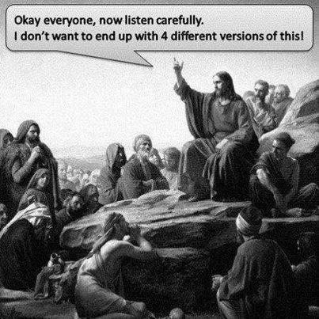
```

## 3. Git + GitHub - What & Why?

```{r out.extra='style="float:right; padding:10px"', out.width = '20%'}
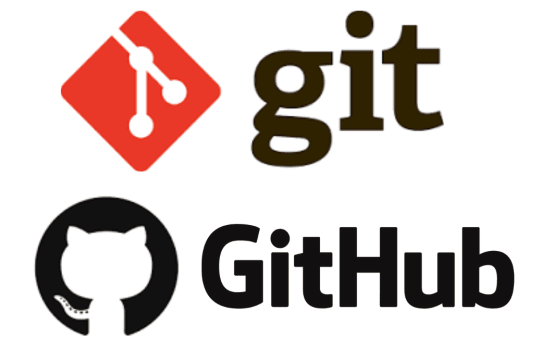
```

- **What it does:**
  + Tracks changes to files (data and code) over time: Sequence of "snapshots" (**commits**), organized in **repositories**
  + Allows to "go back in time": Recall older versions or revert the entire project
  + Changes between commits can be compared
  + **GitHub**: Popular server for sharing materials (**privately or publicly**) and collaborating via git (also: GitLab and others)
  
## 3. Git + GitHub - What & Why?

```{r out.extra='style="float:right; padding:10px"', out.width = '35%'}
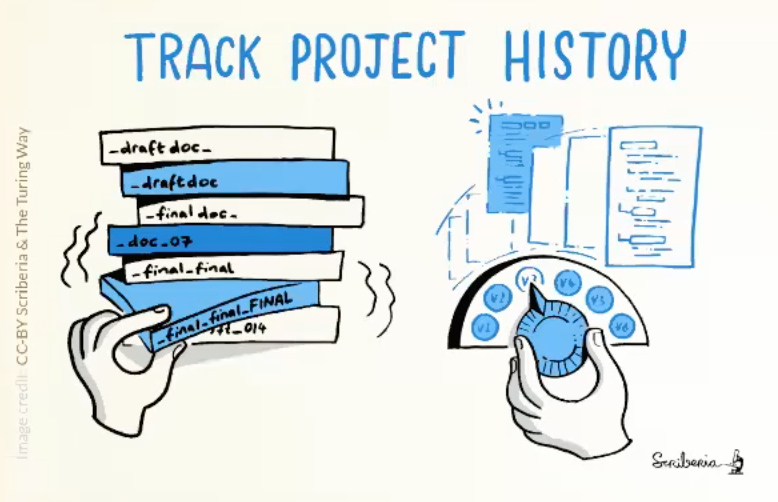
```

- **Why it helps:**
  + Keep things organized and track changes
  + Clean up code
  + Language agnostic
  + (Remote) backup
  + Work together with collaborators (even simultaneously and in parallel: branches, merges, pull requests) - and your future self
  + Web interface for your project and to track issues
  + Easily connected e.g. to the Open Science Framework (<https://osf.io>)

## 3. Git + GitHub – Installation

- Register an account with GitHub: <https://github.com/>
- (Update R, RStudio, and your packages: `update.packages(ask = FALSE, checkBuilt = TRUE)`)
- **Is Git installed?** Open your shell ("Terminal" in RStudio and on Mac, "Eingabeaufforderung" on Windows), and type: `git --version`. If "`git: command not found`": 
- **Install Git - Mac**: Mac automatically offers installing developer command line developer tools. Click "Install". If you don't get the offer, type: `xcode-select --install`. Restart R.
- **Install Git - Windows**: Install "Git Bash" (<https://gitforwindows.org>). Accept default settings. When asked about "Adjusting your PATH environment", select "Git from the command line and also from 3-rd party software". Restart R.
- Configure Git: In the (Git Bash) shell, type
  + `git config --global user.name 'your name'`
  + `git config --global user.email 'email associated with your GitHub account'`
  + `git config --global --list` (Check whether everything worked)
- *Optional:* Install a Git client. Find more info e.g. here: <https://happygitwithr.com/git-client.html> 

## 3. Git + GitHub – Vocabulary

- Vocabulary - *Git*: 
  + **Repo(sitory)**: Directory of files that Git manages holistically
  + **Commit**: Snapshot of all files in the repository, at a specific moment, each with a unique identifier (**hash code** or SHA) and description (**commit message**)
  + **Diff**: Set of differences between (any) two commits
  + **Tag**: Specific name for a certain snapshot (optional), e.g. "v1.0.3", "preprint", "submitted"

```{r fig.align = 'center', out.width = '50%'}
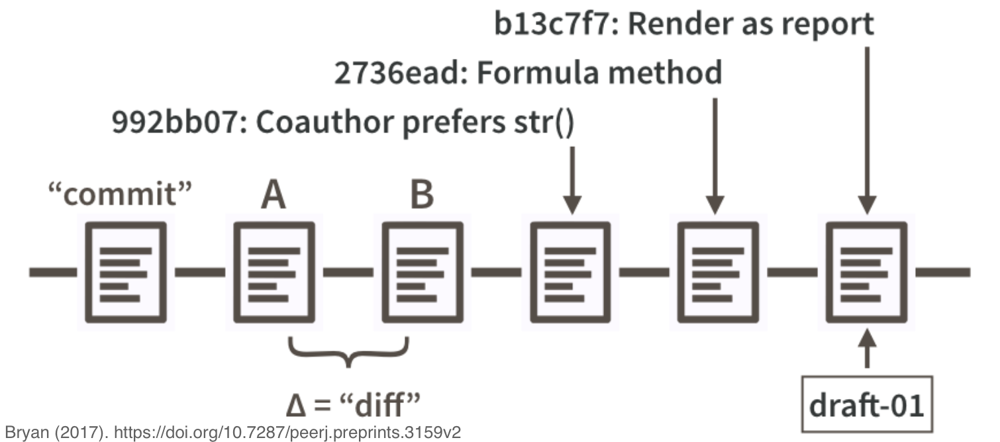
```

## 3. Git + GitHub – Vocabulary

- Vocabulary - *Git*: 
  + **Repo(sitory)**: Directory of files that Git manages holistically
  + **Commit**: Snapshot of all files in the repository, at a specific moment, each with a unique identifier (**hash code** or SHA) and description (**commit message**)
  + **Diff**: Set of differences between (any) two commits
  + **Tag**: Specific name for a certain snapshot (optional), e.g. "v1.0.3", "preprint", "submitted"
- Vocabulary - *GitHub*
  + **Push**: Send your local Git commits to GitHub
  + **Pull**: Compare and update your local Git with GitHub
  + **Merge conflict**: Git can't be certain how to jointly apply diffs from two commits to their common parent. Resolve by picking manually, avoid by pushing often.

```{r fig.align = 'center', out.width = '38%'}
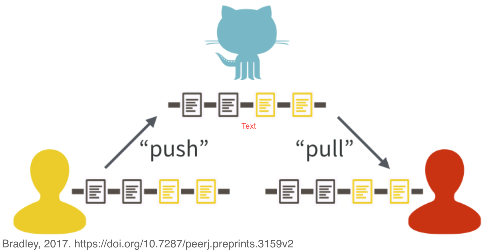
```

## 3. Git + GitHub - How?

```{r out.extra='style="float:right; padding:10px"', out.width = '70%'}
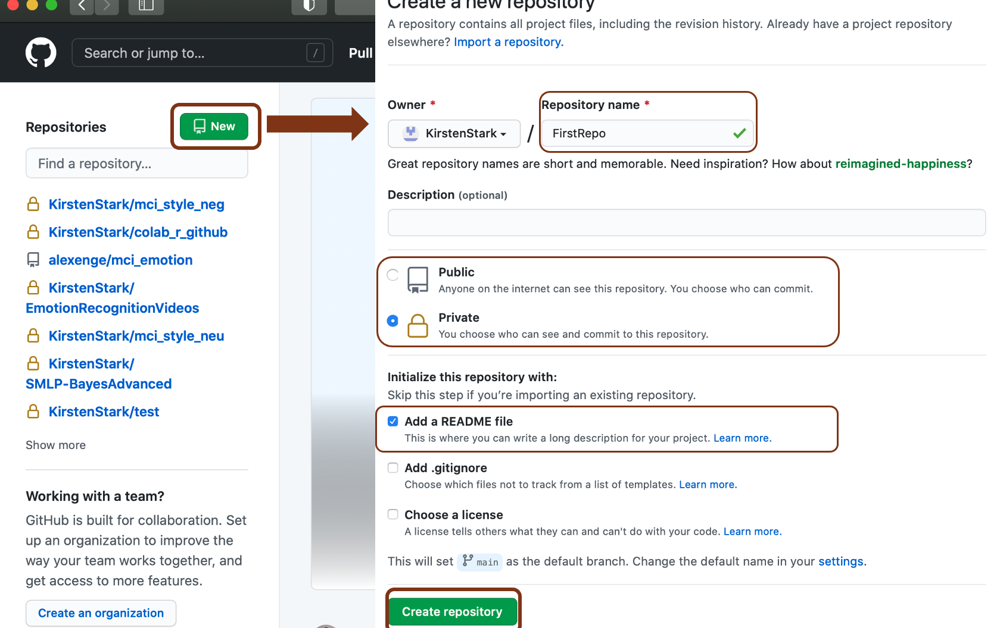
```

- Go to <https://github.com/> and log in
- Click on "New repository"
  + Decide between "private" or "public". Initialize with a README. Accept default settings for everything else.
  + Click "Create repository"
  + Copy the URL
    
## 3. Git + GitHub - How?

- Clone your repository to RStudio
  + File > New Project > Select "Version Control" > Select "Git" > Enter your repository URL: `https://github.com/YOUR-USERNAME/YOUR-REPOSITORY.git`
  
```{r out.extra='style="float:right; padding:10px"', out.width = '70%'}
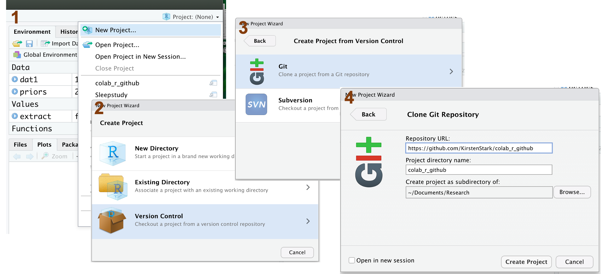
```

## {data-background="figures/use_git_in_R.png"}
## {data-background="figures/git_r_select_for_commit.png"}
## {data-background="figures/github_r_commit_message.png"}
## {data-background="figures/github_r_commit.png"}
## {data-background="figures/github_r_push.png"}

## 3. Git + GitHub - Tricks & Troubleshooting

- **GitHub:** No long-term guarantee for availability of service (GitHub is commercial)
  + **Mirror snapshots on HU servers/OSF/Zenodo/FigShare/...**
- GitHub generally works better with non-proprietary (text) file formats (e.g., CSV) than with proprietary file formats (e.g., XLSX)
  + .md-files will be displayed like HTML
  + .csv-files will have a nice layout
  + README.md-files act like the landing page
  + Use internal links to refer to other files

# 4. Package management: renv

```{r out.width='55%', fig.align='right'}
# # This was used to create the plot. To run this code, please install pkggraph and ggplot2.
# library(dplyr)
# library(ggplot2)
# pkggraph::init(local = TRUE)
# pkggraph::get_all_dependencies("lmerTest", level = 10, relation = c("Depends", "Imports"), strict = TRUE) %>%
#   pkggraph::make_neighborhood_graph() %>%
#   plot() +
#   theme(panel.border = element_rect()) +
#   ggsave("figures/lmerTest_depends.png", width = 20, height = 14, units = "cm", dpi = 600)
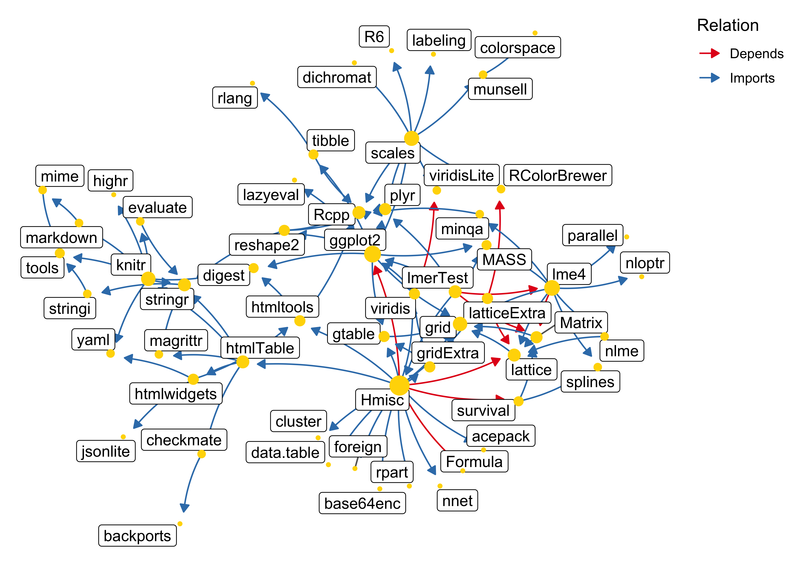
```

## 4. renv – What & Why?

```{r out.extra='style="float:right; padding:10px"', out.width = '10%'}
include_graphics("figures/renv.png")
```

- **What it does:**
  + Creates a project-specific library of packages in the project folder<br>(instead of `C:/Program Files/R/R-4.0.2/library` or the like)
  + Overwrites `install.packages()` to install packages in this local library
  + Keeps track of package versions in the `renv.lock` file

<br>

- **Why it helps:**
  + Keeps package versions untouched by other projects
  + Allows you to revert to the previous state when a package update has broken your analysis
  + Makes it easier to share package versions with your collaborators (e.g., via GitHub)
  + Can also keep track of Python packages

## 4. renv – How?

```{r out.extra='style="float:right; padding:10px"', out.width = '10%'}
include_graphics("figures/renv.png")
```

1. Install renv just like any other R package via `install.packages(renv)`
2. Open your project and initialize your project library via `renv::init()`
3. After successfully installing or updating a package, use `renv::snapshot()`. This will write the current version of all packages that are used in the project to the lockfile.
4. If you want to revert to previous state (e.g., if an update to any of your packages has caused problems), use `renv::restore()`

```{r out.extra='style="float:left; padding:10px"', out.width = '60%'}
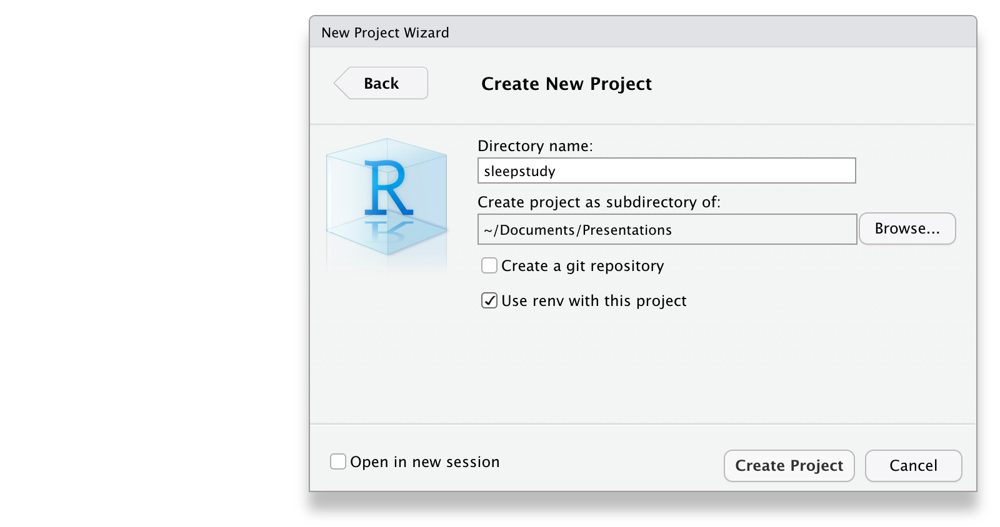
```

<br>

Instead of step #2, you can also select "Use renv with this project" during project creation.

## 4. renv – Initializing the project library

```{r fig.align='right', out.width='90%'}
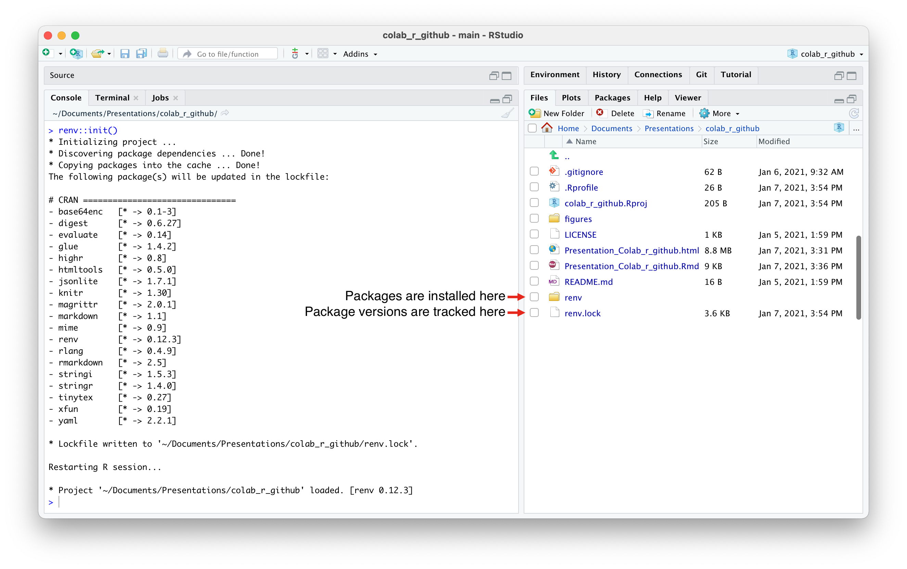
```

## 4. renv – Example of a lockfile

```{r fig.align='right', out.width='90%'}
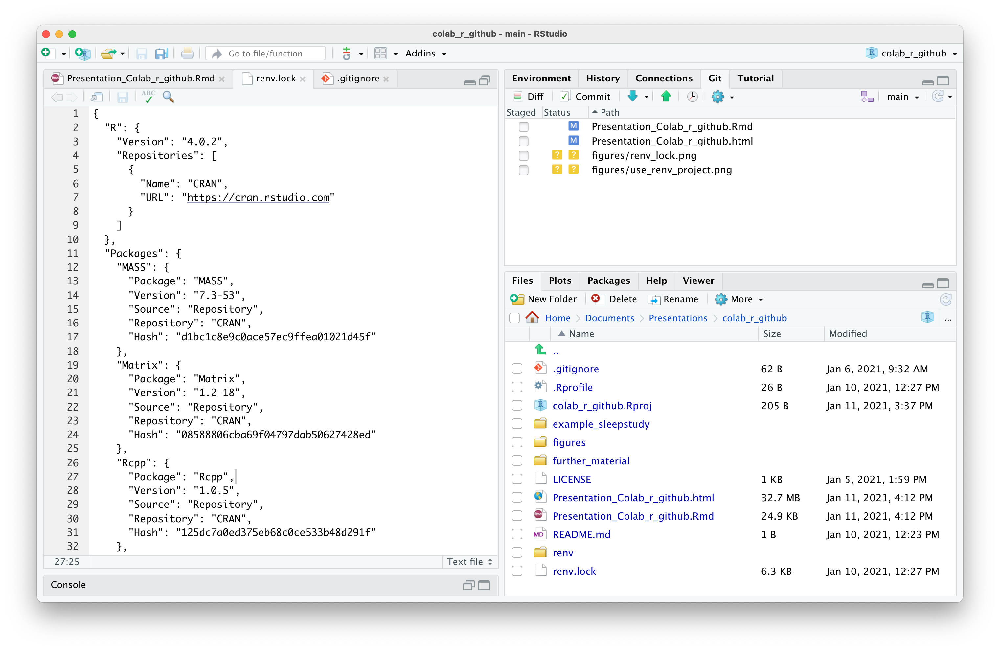
```

## 4. renv – How?

```{r out.extra='style="float:right; padding:10px"', out.width = '10%'}
include_graphics("figures/renv.png")
```

Restoring someone else's package versions:

1. Clone or pull the repository from GitHub
2. Open the the RStudio project (e.g. via the `projectname.Rproj` file)
3. Use `renv::restore()` to install the package versions from the `renv.lock` file

## 4. renv – Troubleshooting

```{r out.extra='style="float:right; padding:10px"', out.width = '10%'}
include_graphics("figures/renv.png")
```

- There may be some (inconsequential) warnings when switching between Mac and Windows
- Installing and loading packages may take a while, especially if your project lives on a network drive (such as `N:/`)
- For installing packages that are not on CRAN you can use `remotes::install_github()` and the like. Note, however, that at least on Windows, you may need to install additional tools for building these packages (via `renv::equip()` and/or from https://cran.r-project.org/bin/windows/Rtools/)

# 5. Containerization: Docker

```{r fig.align='right', out.width='55%'}
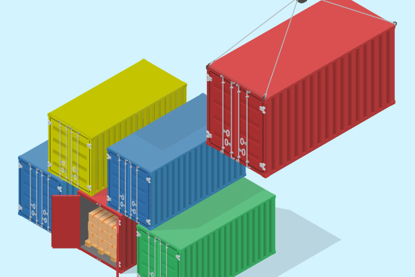
```

## 5. Docker – What & Why?

- **What it does:**
  + Creates a small, linux-based virtual machine on your computer
  + Makes it possible to run your scripts (or render your `.Rmd` files) on this virtual system
  + The recipe to build this system is stored in a `Dockerfile` that can be shared via GitHub

<br>

- **Why it helps:**
  + Prevents differences between operating systems, R versions, region and language settings etc.
  + Ensures long-term reproducibility
  + Provides a starting point for cloud-based and high perfomance computing (HPC)
  + Pre-packaged Docker images are available for different languages (R, Python, MATLAB, LaTeX etc.)

```{r out.extra='style="float:right; padding:10px"', out.width = '10%'}
include_graphics("figures/docker.png")
```

## 5. Docker – How?

1. Install Docker from https://docs.docker.com/installation/ and run it
2. Select the appropiate Docker image (see https://hub.docker.com/search?q=rocker&type=image)
    + `rocker/rstudio` contains R and RStudio
    + `rocker/tidyverse` adds the tidyverse packages
    + `rocker/verse` adds LaTeX
2. From the terminal, run a Docker container based on this image:

```{bash, echo=TRUE, eval=FALSE}
docker run -e PASSWORD=1234 -p 8787:8787 -v /path/to/your/project:/home/rstudio/ rocker/rstudio
```

- `-e PASSWORD=1234 -p 8787:8787` makes it possible to connect to RStudio (running in the container) from your web browser by opening http://localhost:8787 (username: rstudio, password: 1234)
- `-v /path/to/your/project:/home/rstudio/` makes your project available within the container
- `rocker/rstudio` is the name of the Docker image you have chosen above

## 5. Docker – How?

- You can get additional flexibility by creating your own `Dockerfile`
  + A Dockerfile is a text file which acts like a recipe to build your own Docker container<br>(which you can then run)
  + It is based on an existing Docker image (e.g., `rocker/verse`)
  + It can contain additional lines of code to install software (e.g., `renv::restore()`)<br>or run scripts (e.g., `rmarkdown::render(...)`)

```{r out.extra='style="float:right; padding:10px"', out.width = '10%'}
include_graphics("figures/docker.png")
```

<br>

- For detailed instructions, see [Boettiger & Eddeulbuettel (2017)](https://journal.r-project.org/archive/2017/RJ-2017-065/index.html) and<br>[Peikert & Brandmaier (2020)](https://psyarxiv.com/8xzqy/)

## 5. Docker – Example of a Dockerfile

```{bash, echo=TRUE, eval=FALSE}
# This as a text file stored with the name "Dockerfile" in your project directory.

# Base image from Docker Hub, including R, RStudio, the tidyverse, and LaTeX
FROM rocker/verse:4.0.2

# Set working directory within the container
WORDIR /home/rstudio

# Install renv
RUN R -e "remotes::install_version('renv', version = '0.12.0', repos = 'http://cran.us.r-project.org')"

# Copy the lock file
COPY renv.lock renv.lock

# Install package versions stored in the lockfile
RUN R -e "renv::consent(provided = TRUE)"
RUN R -e "renv::restore(prompt = FALSE)"

# When the container is run, render the report / mansucript
ENTRYPOINT Rscript -e "rmarkdown::render('my_manuscript.Rmd')"
```

## 5. Docker – And beyond

- Docker is the basis for other tools for running analyses in the cloud or on high performance computing (HPC) clusters:
  + With **binder** (https://mybinder.org) and **Code Ocean** (https://codeocean.com), you can run your analysis in the cloud; they will even create the `Dockerfile` for you if you don't have your own one
  + **Singularity** (https://sylabs.io) is a fully compatible, open source clone of Docker which you can use on systems where you don't have root access (e.g., on HPC clusters)

<br>

```{r, fig.align='center', out.width='80%'}

```

# 6. Where to start?

```{r fig.align='right', out.width='60%'}

```

## 6. Where to start?

- **This wealth of tools can seem overwhelming**
  + Adopting even one or two of them can help making your code more reproducbile
- An **RStudio project** and **renv** are easy to set up even for existing projects
  + And will help a lot to make sure that you can still run your code at re-submission
- **Version control** is best tried out with a new (real or toybox) project
  + Create an empty repository on GitHub and use it to create your RStudio project
- Once you've made it this far, full computational reproduciblity (by **containerizing** your project) is just one more step away

```{r fig.align='right', out.width='20%'}
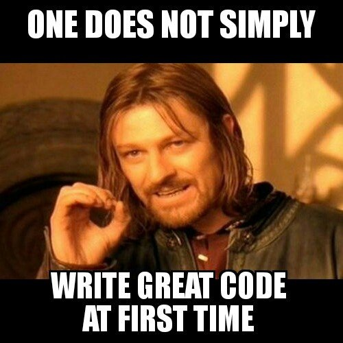
```

# 7. Code along

```{r fig.align = "right", out.width = '50%'}

```

## Code along: GitHub repository

- **Create a GitHub repository**: 
  + Go to <https://github.com/login>. Enter your username and password. 
  + Click on  {#id .class width=50px} .
  + Choose a name for your repository (e.g., "random_numbers").
  + Decide if your repository should be public or private. You can change this later.
  + Select "Add a README file". Leave the rest unchecked.
  + Click on "Create repository" 
  + Copy the URL from the address bar (e.g., <https://github.com/username/random_numbers.git>).

## Code along: RStudio Project

- **Open R Studio and create an R project**: 
  + File > New Project... > Version Control > Git
  + Paste the URL and choose where to create the project folder (Browse...). Leave the project name unchanged. 
  + Click on "Create Project".
  + If your project is private, you may be asked to provide your GitHub username and password.
  + Alternatively, you can clone your repository from the terminal:

```{r echo=TRUE, eval=FALSE}
git clone https://github.com/username/random_numbers.git
cd random_numbers
```
    
## Code along: Stage, commit, and push to GitHub

- **Make a change to your README file**:
  + Open the `README.md` file from the "Files" pane
  + Make a change to the README (e.g., add a line saying "This is my first GitHub repository")
  + Terminal alternative:

```{r echo=TRUE, eval=FALSE}
echo "This is my first GitHub repository" >> README.md
```

## Code along: Stage, commit, and push to GitHub

  + **Commit**:
    - Open the Git pane (next to the Environment) > Click on the "Commit" button
    - In the window that pops up, *stage* your changed files (by ticking them) > Click on "Commit" > Enter a *commit message* (e.g., "edited readme") > Click on "Commit"
    - Terminal alternative:

```{r echo=TRUE, eval=FALSE}
echo "git add -A"
git commit -m "edited readme"
```

  + **Push to GitHub**:
    - Click on "Push" > Close
    - Terminal alternative:
    
```{r echo=TRUE, eval=FALSE}
git push
```

## Code along: RMarkdown

- **Install RMarkdown**: Type `install.packages(c("rmarkdown", "knitr"))` to the console
- **Create an RMarkdown file**: 
  + File > New File > R Markdown...
  + Choose "From template" and "GitHub Document (Markdown)" > Ok

## Code along: RMarkdown

- **Make changes to your Markdown file**:
  + Change the title from "Untitled" to "My analysis"
  + Remove the template text (everthing starting from "## GitHub Documents" at ~ line 10).
  + Enter a section title ("## Random number generation"), some text ("Here, we generate a random number between 0 and 10."), and an R code chunk (via "Insert" > "R"):

```{r echo=TRUE, eval=FALSE}
set.seed(1234)
number <- sample(x = 0:10, size = 1, replace = FALSE)
print(number)
```

- **Knit your Markdown**: Click on the "Knit" button. You may be asked to choose a file name<br>(e.g., "my_analysis.Rmd")
- **Commit and push your change**: From the Git pane: Commit > Stage files > Enter commit message > Commit > Push

## Code along: RMarkdown

```{r fig.align='center', out.width='80%'}
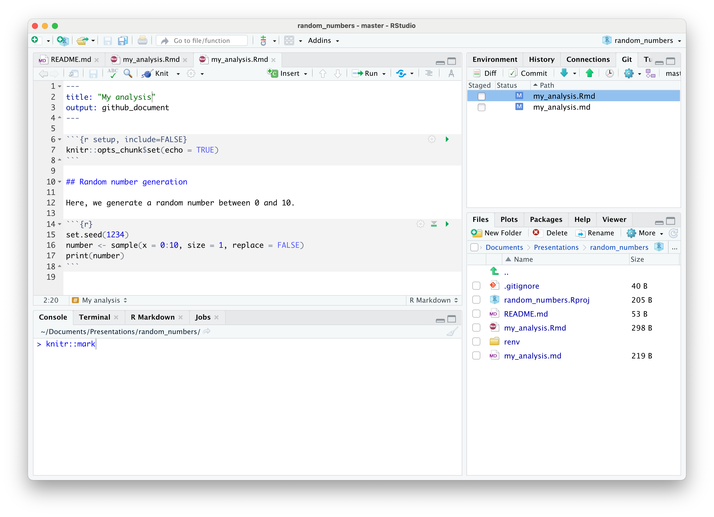
```

## Code along: RMarkdown

```{r fig.align='center', out.width='70%'}
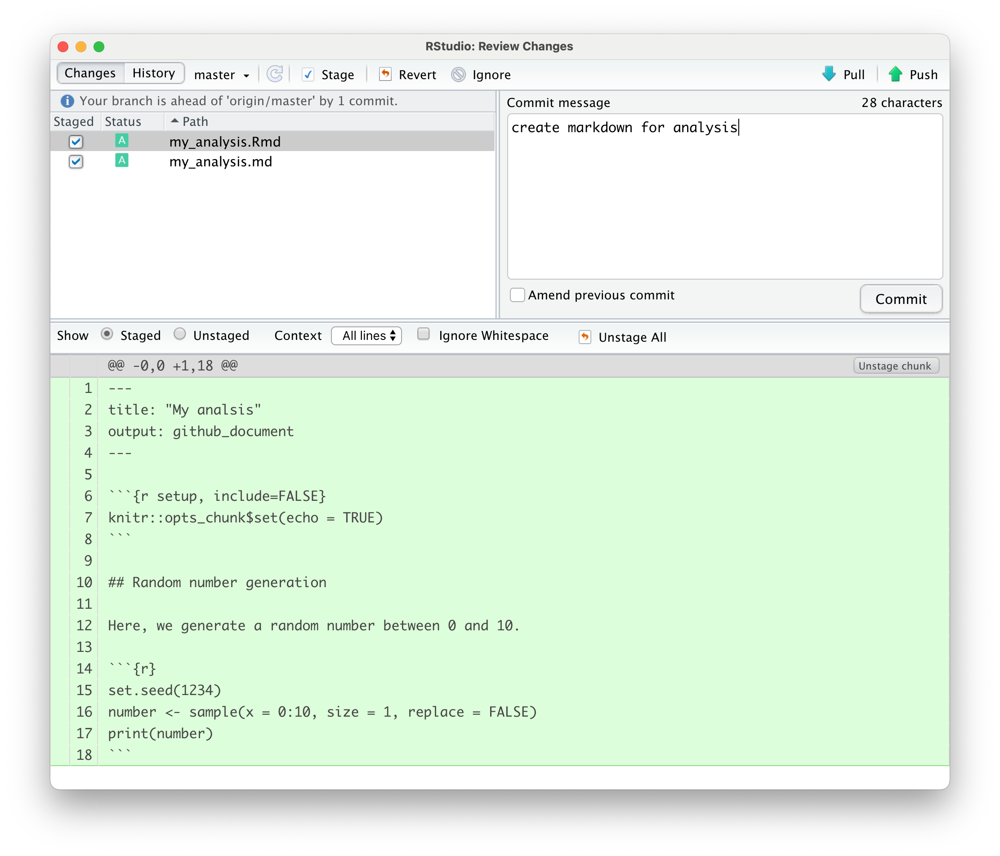
```

## Code along: renv

- In the "Package" pane, check if you have renv installed
  + If not: `install.packages("renv")`
- Initialize your local project library by typing in the console: `renv::init()`
  + You should receive a message like "`* Project '~/random_numbers' loaded. [renv 0.12.0]`"
  + If you want to, take a look at the `renv.lock` from the "Files" pane in RStudio
  + Now, we are ready to install and use some new packages.

## Code along: renv

- From the console, install a new package:

```{r, echo=TRUE, eval=FALSE}
install.packages("cowsay")
```

- Use this package in your RMarkdown file by changing your code chunk to:

```{r, echo=TRUE, eval=FALSE}
set.seed(1234)
number <- sample(x = 0:10, size = 1, replace = FALSE)
text <- paste("My favorite number is", number)
cowsay::say(text, "cow")
```

- Knit the file. If you are asked to install or update additional packages, select "Yes".
- Check the status of your project library by typing to the console: `renv::status()`
- You'll notice that some packages are not yet added to your lockfile. Do so by typing to the console: `renv::snapshot()` > y > *Enter*
- Commit and push your changes to GitHub.

## Congrats!

You now have a (somewhat) reproducible analysis.

```{r fig.align='center', out.width='60%'}
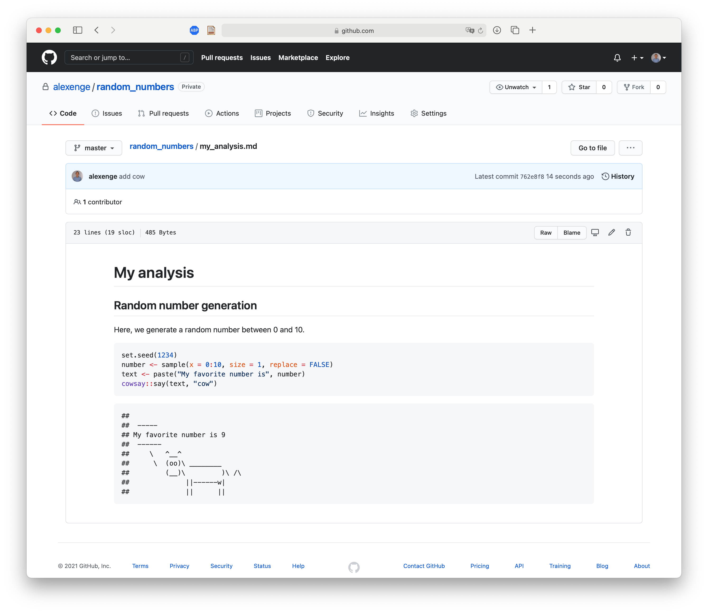
```

# Thank you.

```{r out.extra='style="float:left; padding:10px"', out.width='50%'}
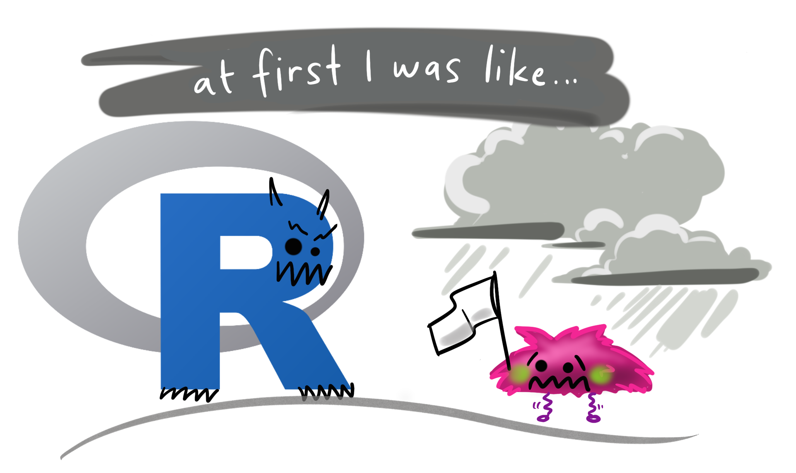
```

<br><br>

```{r out.extra='style="float:right; padding:10px"', out.width='45%'}
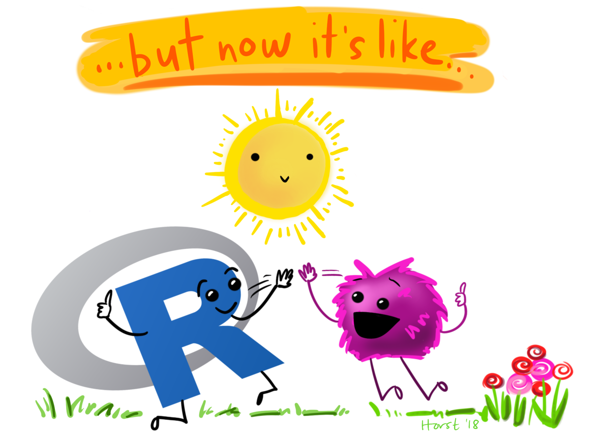
```
